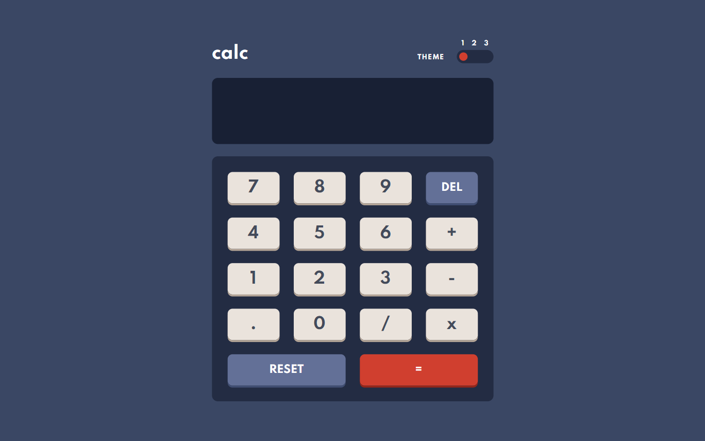

# Frontend Mentor - Calculator app solution

This is a solution to the [Calculator app challenge on Frontend Mentor](https://www.frontendmentor.io/challenges/calculator-app-9lteq5N29). Frontend Mentor challenges help you improve your coding skills by building realistic projects.

## Table of contents

- [Overview](#overview)
  - [The challenge](#the-challenge)
  - [Screenshot](#screenshot)
  - [Links](#links)
- [My process](#my-process)
  - [Built with](#built-with)
  - [What I learned](#what-i-learned)
- [Author](#author)

## Overview

### The challenge

Users should be able to:

- See the size of the elements adjust based on their device's screen size
- Perform mathmatical operations like addition, subtraction, multiplication, and division
- Adjust the color theme based on their preference
- Have their prefered theme saved in local storage

### Screenshot

### Links

- Solution URL: [Add solution URL here](https://your-solution-url.com)
- Live Site URL: [Add live site URL here](https://your-live-site-url.com)

## My process

### Built with

- [React](https://reactjs.org/) - JS library
- TypeScript
- SCSS

### What I learned

I learned how to write Recursion. I never really fully understood how to write recursive functions, but after this challenge, I understand it now. I used recursion for calculations. I also got better at CSS Grid.

## Author

- Frontend Mentor - [@LukaKobaidze](https://www.frontendmentor.io/profile/LukaKobaidze)
- FreeCodeCamp - [@lukakobaidze](https://www.freecodecamp.org/lukakobaidze)
